# 🎓 Student Placement Management System

<p align="center">
  
  
  
  
  
  
  
  
  
  
</p>

<p align="center">
  <b>🚀 An intelligent, secure and scalable platform for managing the complete campus placement lifecycle.</b>
</p>

<p align="center">
  Java • Spring Boot • PostgreSQL • Spring Security • Redis • Kafka • Spring AI • pgvector • Next.js • Docker • AWS
</p>

---

# 📑 Table of Contents

- [📖 Overview](#-overview)
- [🎯 Problem Statement](#-problem-statement)
- [💡 Proposed Solution](#-proposed-solution)
- [🎯 Objectives](#-objectives)
- [✨ Features](#-features)
- [👥 User Roles](#-user-roles)
- [🏗️ Architecture](#️-architecture)
- [🤖 AI Features](#-ai-features)
- [🗄️ Database Design](#️-database-design)
- [🛠️ Technology Stack](#️-technology-stack)
- [🌐 API Documentation](#-api-documentation)
- [📂 Project Structure](#-project-structure)
- [🧪 Testing](#-testing)
- [🔐 Security](#-security)
- [⚡ Performance](#-performance)
- [🐳 Docker](#-docker)
- [⚙️ Setup](#️-setup)
- [☁️ Deployment](#️-deployment)
- [📈 Scalability](#-scalability)
- [🗺️ Development Roadmap](#️-development-roadmap)
- [📚 Software Engineering Documentation](#-software-engineering-documentation)
- [🔮 Future Enhancements](#-future-enhancements)
- [📈 Project Status](#-project-status)
- [🎓 Learning Outcomes](#-learning-outcomes)
- [🧠 Engineering Concepts](#-key-engineering-concepts)
- [👨‍💻 Author](#-author)

---

# 📖 Overview

The **Student Placement Management System** is a full-stack web application designed to digitize and streamline the complete campus placement lifecycle.

The platform provides dedicated workflows for:

- 👨‍🎓 Students
- 🏢 Recruiters
- 👨‍💼 Placement Officers
- 🔧 Administrators

The system aims to replace fragmented spreadsheets, emails, forms and manually maintained records with a centralized, secure and scalable software platform.

### Core Placement Lifecycle

```text
Student Registration
        ↓
Profile Management
        ↓
Resume Upload
        ↓
Placement Drive Discovery
        ↓
Eligibility Verification
        ↓
Application
        ↓
Recruiter Screening
        ↓
Shortlisting
        ↓
Interview
        ↓
Selection
        ↓
Offer
        ↓
Placement Confirmation
        ↓
Analytics
```

---

# 🎯 Problem Statement

Traditional campus placement processes often depend on spreadsheets, emails, forms and manually maintained records.

This creates several operational and technical challenges.

| Problem | Impact |
|---|---|
| 📊 Spreadsheet dependency | Difficult to maintain and scale |
| 📧 Email-based communication | Information becomes fragmented |
| 📝 Manual applications | Repetitive administrative work |
| 🔍 Manual resume screening | Time-consuming recruiter workflow |
| ✅ Manual eligibility checking | Possibility of errors |
| 📅 Manual interview coordination | Scheduling complexity |
| 📁 Scattered documents | Difficult document management |
| 📈 Limited analytics | Difficult decision making |
| 🔔 No centralized notifications | Important updates may be missed |
| 🤖 No intelligent matching | More manual candidate screening |

---

# 💡 Proposed Solution

The proposed system provides a centralized platform for managing the complete placement lifecycle.

### Solution Workflow

```text
┌───────────────────────┐
│       Student         │
└───────────┬───────────┘
            │
            ▼
┌───────────────────────┐
│ Profile + Resume      │
│ Management            │
└───────────┬───────────┘
            │
            ▼
┌───────────────────────┐
│ Placement Drives      │
│ & Job Opportunities   │
└───────────┬───────────┘
            │
            ▼
┌───────────────────────┐
│ Eligibility Engine    │
└───────────┬───────────┘
            │
            ▼
┌───────────────────────┐
│ Application           │
└───────────┬───────────┘
            │
            ▼
┌───────────────────────┐
│ Recruiter Screening   │
└───────────┬───────────┘
            │
            ▼
┌───────────────────────┐
│ Interview Process     │
└───────────┬───────────┘
            │
            ▼
┌───────────────────────┐
│ Selection / Offer     │
└───────────┬───────────┘
            │
            ▼
┌───────────────────────┐
│ Placement Analytics   │
└───────────────────────┘
```

---

# 🎯 Objectives

The main objectives of the system are:

1. Centralize placement-related information.
2. Digitize the campus placement lifecycle.
3. Reduce manual administrative work.
4. Automate eligibility verification.
5. Simplify student applications.
6. Improve recruiter candidate discovery.
7. Provide secure role-based access.
8. Simplify interview scheduling.
9. Provide centralized offer tracking.
10. Generate placement analytics.
11. Introduce AI-assisted recruitment capabilities.
12. Demonstrate scalable backend engineering practices.

---

# ✨ Features

## 👨‍🎓 Student Features

- 🔐 Secure registration and login
- 👤 Profile management
- 🎓 Academic information management
- 💻 Skills management
- 📄 Resume upload
- 💼 Browse placement drives
- ✅ Automatic eligibility checking
- 📝 Apply to placement opportunities
- 📊 Track application status
- 📅 View interview schedules
- 📄 Track offers
- 📈 View placement history
- 🤖 AI-powered resume analysis
- 🎯 Resume-job matching
- 📚 Skill-gap analysis
- 🔔 Placement notifications

---

## 🏢 Recruiter Features

- 🔐 Recruiter authentication
- 🏢 Company profile management
- 💼 Create placement drives
- 📋 Define eligibility criteria
- 👥 View applicants
- 🔍 Filter candidates
- 🤖 AI-assisted candidate search
- 🎯 Candidate-job matching
- ✅ Shortlist candidates
- 📅 Schedule interviews
- 📄 Manage offers
- 📊 Recruitment insights

---

## 👨‍💼 Placement Officer Features

- 👥 Manage students
- 🏢 Manage recruiters
- 💼 Manage placement drives
- ✅ Monitor eligibility
- 📝 Monitor applications
- 📅 Coordinate interviews
- 📄 Track offers
- 📊 Placement analytics
- 📈 Generate reports
- 🔔 Manage placement notifications

---

## 🔧 Administrator Features

- 👤 User management
- 🛡️ Role management
- 🔐 Access control
- ⚙️ System configuration
- 📋 Audit logging
- 📊 System monitoring

---

# 👥 User Roles

| Role | Responsibilities |
|---|---|
| 👨‍🎓 Student | Profile, resume, applications, interviews and offers |
| 🏢 Recruiter | Jobs, candidates, shortlisting, interviews and offers |
| 👨‍💼 Placement Officer | Drives, eligibility, students and placement tracking |
| 🔧 Administrator | Users, roles, permissions and system configuration |

---

# 🏗️ Architecture

## 🔷 High-Level Architecture

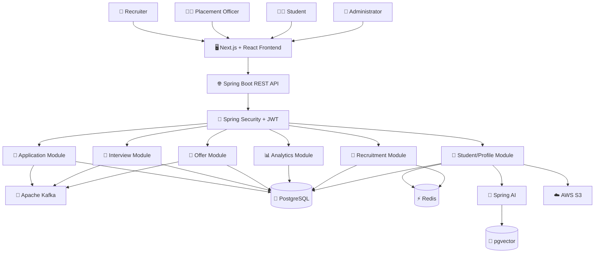

---

## 🔄 Complete Placement Workflow

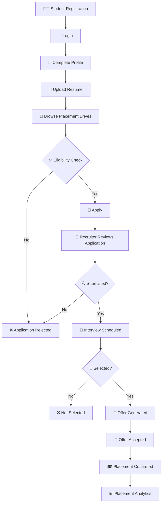

---

## 🧩 Module Architecture

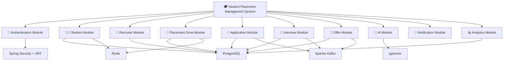

---

## 🤖 AI Architecture

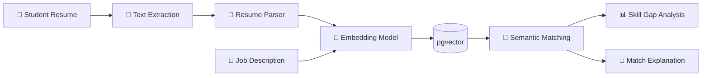

---

## 🔐 Security Architecture

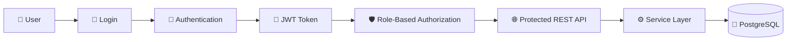

### Security Layers

```text
┌──────────────────────────────────────────┐
│              Client Request              │
├──────────────────────────────────────────┤
│          JWT Authentication              │
├──────────────────────────────────────────┤
│        Role-Based Authorization          │
├──────────────────────────────────────────┤
│           Input Validation               │
├──────────────────────────────────────────┤
│            Business Logic                │
├──────────────────────────────────────────┤
│       Repository / Database Layer        │
└──────────────────────────────────────────┘
```

---

## 📨 Event-Driven Architecture

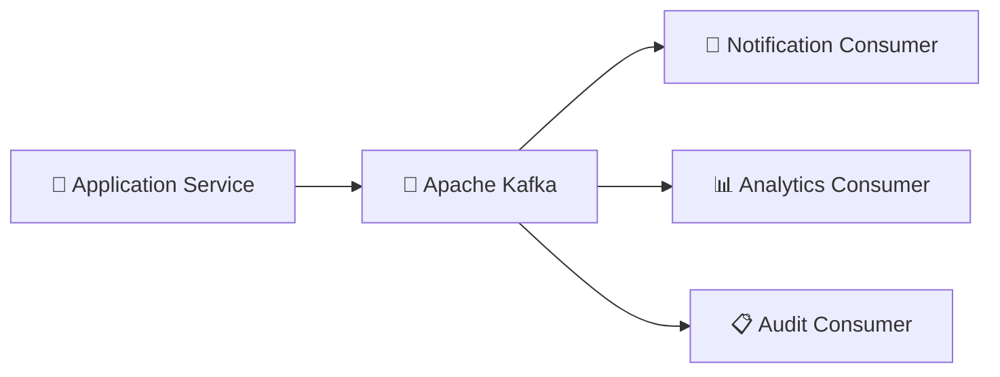

### Event Types

```text
APPLICATION_CREATED
APPLICATION_SHORTLISTED
APPLICATION_REJECTED
INTERVIEW_SCHEDULED
INTERVIEW_COMPLETED
CANDIDATE_SELECTED
OFFER_GENERATED
OFFER_ACCEPTED
PLACEMENT_CONFIRMED
```

### Event Flow

```text
Student Applies
      │
      ▼
Application Service
      │
      ▼
APPLICATION_CREATED
      │
      ▼
Kafka Topic
   ┌──┼─────────────┐
   ▼  ▼             ▼
Email Analytics   Audit
```

---

## ⚡ Caching Architecture

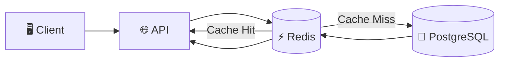

### Potential Cache Targets

- Student profiles
- Placement drives
- Company information
- Eligibility information
- Dashboard statistics
- Frequently accessed reference data

---

# 🤖 AI Features

## 📄 Resume Analysis

The system can analyze uploaded resumes and extract structured information.

### Processing Pipeline

```text
Resume
   │
   ▼
Text Extraction
   │
   ▼
Resume Parsing
   │
   ├── Programming Languages
   ├── Frameworks
   ├── Databases
   ├── Cloud
   ├── Tools
   ├── Projects
   └── Certifications
   │
   ▼
Structured Candidate Profile
   │
   ▼
Embedding Generation
   │
   ▼
Vector Storage
```

---

## 🎯 Resume–Job Matching

The system can compare student profiles against job descriptions using semantic similarity.

### Example

```text
Candidate Skills
────────────────────────
Java
Spring Boot
PostgreSQL
Kafka
Docker
AWS

          +

Job Requirements
────────────────────────
Java
Spring Boot
REST APIs
PostgreSQL
Docker

          ↓

   Semantic Matching

          ↓

   Candidate Analysis
```

---

## 📊 Skill Gap Analysis

The AI layer can identify missing skills between a candidate profile and target job requirements.

```text
Required Skills
────────────────────────
Java
Spring Boot
REST APIs
Docker
Kubernetes
AWS

Candidate Skills
────────────────────────
Java
Spring Boot
REST APIs
Docker

Missing Skills
────────────────────────
Kubernetes
AWS
```

The system can use the identified skill gaps to generate personalized learning recommendations.

---

## 🔎 AI Candidate Search

Recruiters can search candidates using natural-language queries.

### Example

```text
Find students with Java,
Spring Boot, Kafka and AWS
experience with CGPA above 8.
```

The AI layer can convert the natural-language request into structured filters and semantic search criteria.

---

## 💬 Candidate Match Explanation

Instead of returning only a numerical similarity value, the system can provide an explanation of the candidate-job relationship.

```text
Candidate Match

✓ Java experience
✓ Spring Boot experience
✓ PostgreSQL experience
✓ Docker experience
✓ REST API experience

⚠ Kubernetes experience missing

Explanation:
The candidate matches most of the
technical requirements but lacks
Kubernetes experience.
```

---

# 🗄️ Database Design

## Entity Relationship Diagram

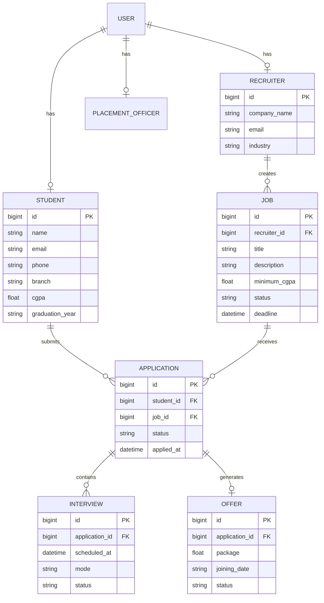

---

# 🧱 Data Storage Strategy

| Technology | Responsibility |
|---|---|
| 🐘 PostgreSQL | Primary transactional application data |
| 🧠 pgvector | Embeddings and semantic search |
| ⚡ Redis | Frequently accessed cached data |
| ☁️ AWS S3 | Resume and document storage |
| 📨 Kafka | Event streams and asynchronous processing |

---

# 🛠️ Technology Stack

## Backend

| Technology | Purpose |
|---|---|
| ☕ Java 21 | Primary programming language |
| 🌱 Spring Boot | Backend framework |
| 🌐 Spring Web | REST APIs |
| 🔐 Spring Security | Authentication and authorization |
| 🎫 JWT | Stateless authentication |
| 🤖 Spring AI | AI integration |
| 📦 Maven | Dependency management |

## Database

| Technology | Purpose |
|---|---|
| 🐘 PostgreSQL | Primary relational database |
| 🧠 pgvector | Vector similarity search |
| ⚡ Redis | Caching |

## Messaging

| Technology | Purpose |
|---|---|
| 📨 Apache Kafka | Event-driven communication |

## Frontend

| Technology | Purpose |
|---|---|
| ▲ Next.js | Frontend framework |
| ⚛️ React | UI development |
| 🎨 Tailwind CSS | Styling |

## Infrastructure

| Technology | Purpose |
|---|---|
| 🐳 Docker | Containerization |
| ☁️ AWS | Cloud infrastructure |
| ☁️ Amazon S3 | File storage |

---

# 🌐 API Documentation

The backend follows RESTful API design principles.

## 🔐 Authentication APIs

```http
POST /api/auth/register
POST /api/auth/login
POST /api/auth/refresh
POST /api/auth/logout
```

---

## 👨‍🎓 Student APIs

```http
GET    /api/students
GET    /api/students/{id}
POST   /api/students
PUT    /api/students/{id}
DELETE /api/students/{id}

GET    /api/students/{id}/applications
GET    /api/students/{id}/interviews
GET    /api/students/{id}/offers
```

---

## 🏢 Recruiter APIs

```http
GET    /api/recruiters
GET    /api/recruiters/{id}
POST   /api/recruiters
PUT    /api/recruiters/{id}
DELETE /api/recruiters/{id}
```

---

## 💼 Placement Drive APIs

```http
GET    /api/drives
GET    /api/drives/{id}
POST   /api/drives
PUT    /api/drives/{id}
DELETE /api/drives/{id}
```

---

## 📝 Application APIs

```http
POST   /api/applications
GET    /api/applications/{id}
PUT    /api/applications/{id}
PATCH  /api/applications/{id}/status
DELETE /api/applications/{id}
```

---

## 📅 Interview APIs

```http
POST   /api/interviews
GET    /api/interviews/{id}
PUT    /api/interviews/{id}
DELETE /api/interviews/{id}
```

---

## 📄 Offer APIs

```http
POST   /api/offers
GET    /api/offers/{id}
PUT    /api/offers/{id}
PATCH  /api/offers/{id}/status
```

---

## 🤖 AI APIs

```http
POST /api/ai/resume/analyze
POST /api/ai/resume/match
POST /api/ai/skills/gap-analysis
POST /api/ai/candidates/search
POST /api/ai/candidates/explain
```

---

# 📂 Project Structure

```text
student-placement-management-system/
│
├── backend/
│   │
│   ├── src/
│   │   ├── main/
│   │   │   ├── java/
│   │   │   │   └── com/
│   │   │   │       └── placement/
│   │   │   │
│   │   │   │       ├── auth/
│   │   │   │       │   ├── controller/
│   │   │   │       │   ├── service/
│   │   │   │       │   ├── repository/
│   │   │   │       │   ├── entity/
│   │   │   │       │   └── dto/
│   │   │   │       │
│   │   │   │       ├── student/
│   │   │   │       │   ├── controller/
│   │   │   │       │   ├── service/
│   │   │   │       │   ├── repository/
│   │   │   │       │   ├── entity/
│   │   │   │       │   └── dto/
│   │   │   │       │
│   │   │   │       ├── recruiter/
│   │   │   │       ├── placement/
│   │   │   │       ├── application/
│   │   │   │       ├── interview/
│   │   │   │       ├── offer/
│   │   │   │       ├── ai/
│   │   │   │       ├── notification/
│   │   │   │       ├── analytics/
│   │   │   │       ├── exception/
│   │   │   │       └── config/
│   │   │
│   │   └── resources/
│   │       ├── application.yml
│   │       └── db/
│   │
│   └── test/
│
│   ├── pom.xml
│   └── Dockerfile
│
├── frontend/
│   ├── app/
│   ├── components/
│   ├── services/
│   ├── hooks/
│   ├── utils/
│   ├── public/
│   ├── package.json
│   └── Dockerfile
│
├── docs/
│   ├── Experiment-1.md
│   ├── Experiment-2.md
│   ├── Experiment-3.md
│   └── architecture/
│       ├── system-architecture.md
│       ├── database-design.md
│       └── api-design.md
│
├── docker-compose.yml
├── .gitignore
├── README.md
└── LICENSE
```

---

# 🧪 Testing

The project follows a layered testing strategy.

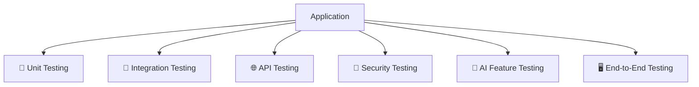

## Testing Technologies

- JUnit 5
- Mockito
- Spring Boot Test
- MockMvc
- Testcontainers
- Postman
- Integration Testing

### Testing Areas

- Authentication
- Authorization
- Student management
- Recruiter management
- Placement drives
- Applications
- Interview scheduling
- Offer management
- AI services
- Kafka events
- Redis caching
- Database transactions

---

# 🔐 Security

Security is a core part of the application.

## Authentication Flow

```text
Username / Email
       ↓
Password
       ↓
Spring Security
       ↓
Password Verification
       ↓
JWT Generation
       ↓
Authenticated Request
```

## Authorization Flow

```text
JWT
 ↓
User Identity
 ↓
User Role
 ↓
RBAC
 ↓
Endpoint Permission
```

## Security Features

- 🔐 JWT authentication
- 🛡️ Role-Based Access Control
- 🔑 Password hashing
- 🚫 Unauthorized request protection
- 🧹 Request validation
- 🔒 Protected REST endpoints
- 📋 Audit logging
- 🌐 CORS configuration
- 🛡️ Secure exception handling

---

# ⚡ Performance

Performance considerations include:

### 🚀 Database Optimization

- Proper indexing
- Pagination
- Query optimization
- Connection pooling
- Transaction management

### ⚡ Caching

Redis can be used for frequently accessed data.

### 📨 Asynchronous Processing

Kafka can be used for operations that do not need to block the primary request.

```text
Synchronous Request
       │
       ▼
Critical Business Operation
       │
       ▼
Response

       +

Asynchronous Event
       │
       ▼
Kafka
       │
   ┌───┼─────────┐
   ▼   ▼         ▼
 Email Analytics Audit
```

---

# 🐳 Docker

The application can be containerized using Docker.

## Container Architecture

```text
┌────────────────────────────────────────────┐
│              Docker Compose                │
│                                            │
│  ┌────────────┐    ┌──────────────────┐   │
│  │ Frontend   │    │ Backend          │   │
│  │ Next.js    │───▶│ Spring Boot      │   │
│  └────────────┘    └─────────┬────────┘   │
│                              │            │
│             ┌────────────────┼────────┐   │
│             ▼                ▼        ▼   │
│        PostgreSQL          Redis    Kafka │
│                                            │
└────────────────────────────────────────────┘
```

## Start Services

```bash
docker compose up -d
```

## Stop Services

```bash
docker compose down
```

## View Running Containers

```bash
docker ps
```

---

# ⚙️ Setup

## Prerequisites

Make sure the following are installed:

```text
Java 21+
Maven
Node.js
npm
PostgreSQL
Docker
Git
```

---

## 1️⃣ Clone Repository

```bash
git clone <YOUR_GITHUB_REPOSITORY_URL>

cd student-placement-management-system
```

---

## 2️⃣ Start Infrastructure

```bash
docker compose up -d
```

---

## 3️⃣ Configure Backend

Create or update:

```text
backend/src/main/resources/application.yml
```

Example:

```yaml
spring:
  datasource:
    url: jdbc:postgresql://localhost:5432/placement_db
    username: postgres
    password: postgres

  jpa:
    hibernate:
      ddl-auto: update

  data:
    redis:
      host: localhost
      port: 6379
```

---

## 4️⃣ Run Backend

### Linux / macOS

```bash
cd backend
./mvnw spring-boot:run
```

### Windows

```bash
cd backend
mvnw.cmd spring-boot:run
```

Backend:

```text
http://localhost:8080
```

---

## 5️⃣ Run Frontend

```bash
cd frontend

npm install

npm run dev
```

Frontend:

```text
http://localhost:3000
```

---

# ☁️ Deployment

The target deployment architecture uses cloud infrastructure.

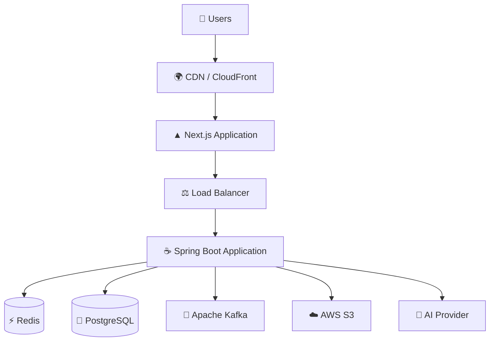

---

# 📈 Scalability

The initial architecture follows a **modular monolith** approach.

### Advantages

- Simple development
- Easier deployment
- Clear domain boundaries
- Lower operational complexity
- Easier debugging
- Easier local development

As system traffic and domain complexity increase, individual modules can be extracted into independently deployable services.

## Future Service Evolution

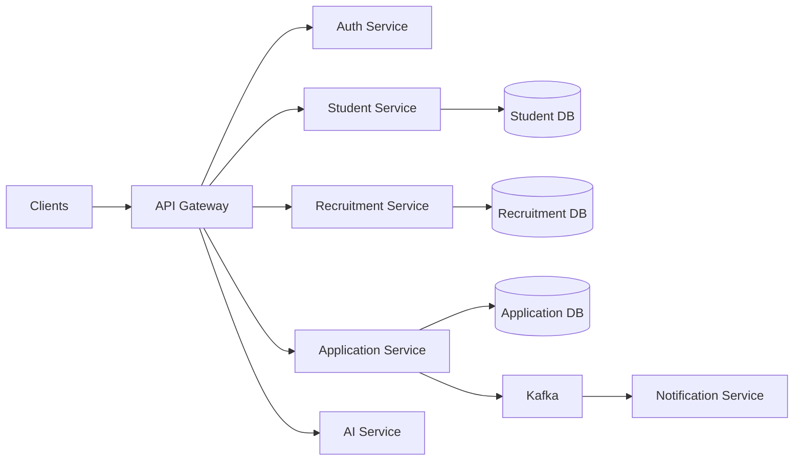

---

# 🗺️ Development Roadmap

```mermaid
flowchart LR

    A["Phase 1<br/>Requirements"]
    B["Phase 2<br/>System Design"]
    C["Phase 3<br/>Database"]
    D["Phase 4<br/>Authentication"]
    E["Phase 5<br/>Core Backend"]
    F["Phase 6<br/>Frontend"]
    G["Phase 7<br/>Redis + Kafka"]
    H["Phase 8<br/>AI Features"]
    I["Phase 9<br/>Testing"]
    J["Phase 10<br/>Docker"]
    K["Phase 11<br/>Cloud Deployment"]

    A --> B
    B --> C
    C --> D
    D --> E
    E --> F
    F --> G
    G --> H
    H --> I
    I --> J
    J --> K
```

---

# 📚 Software Engineering Documentation

The project follows a structured software engineering process.

| Experiment | Topic | Status |
|---|---|---|
| Experiment 1 | Requirement Analysis | ✅ Completed |
| Experiment 2 | Problem Identification & Feasibility | ✅ Completed |
| Experiment 3 | Stakeholder Identification & Requirement Elicitation | ✅ Completed |
| Experiment 4 | Software Design | 🔄 Planned |
| Experiment 5 | UML Modeling | 🔄 Planned |
| Experiment 6 | Software Testing | 🔄 Planned |

### Documentation Structure

```text
docs/
│
├── Experiment-1.md
├── Experiment-2.md
├── Experiment-3.md
│
└── architecture/
    ├── system-architecture.md
    ├── database-design.md
    └── api-design.md
```

---

# 📐 Non-Functional Requirements

```text
                         SYSTEM QUALITY
                               │
          ┌────────────────────┼────────────────────┐
          │                    │                    │
          ▼                    ▼                    ▼
     PERFORMANCE            SECURITY           SCALABILITY
          │                    │                    │
          ▼                    ▼                    ▼
       Fast APIs           JWT + RBAC         Redis + Kafka
          │                    │                    │
          └────────────────────┼────────────────────┘
                               │
                               ▼
                         RELIABILITY
                               │
                               ▼
                       MAINTAINABILITY
```

### Performance

- Low response latency
- Efficient database queries
- Caching
- Pagination
- Asynchronous processing

### Security

- JWT authentication
- RBAC
- Input validation
- Secure password storage

### Scalability

- Modular architecture
- Stateless APIs
- Redis caching
- Kafka events
- Cloud deployment

### Maintainability

- Separation of concerns
- Modular packages
- DTO-based APIs
- Centralized exception handling
- Automated tests

---

# 🔮 Future Enhancements

## 🤖 AI

- Advanced candidate matching
- AI resume improvement
- AI interview preparation
- AI mock interviews
- Personalized career recommendations
- Automated job recommendations
- LLM-powered recruiter assistant

## 📊 Analytics

- Placement analytics dashboard
- Department-wise analytics
- Skill demand analytics
- Company-wise hiring trends
- Student placement reports

## 🔔 Communication

- Email notifications
- Push notifications
- Real-time notifications
- Automated recruiter communication

## 📱 Platform

- Mobile application
- Progressive Web App
- Real-time dashboard
- Advanced recruiter portal

## ☁️ Infrastructure

- Cloud production deployment
- CI/CD pipeline
- Centralized logging
- Metrics and monitoring
- Distributed tracing
- Auto-scaling

---

# 📈 Project Status

```text
🚧 PROJECT STATUS: ACTIVE DEVELOPMENT

Requirements              ✅ Completed
Problem Analysis          ✅ Completed
Stakeholder Analysis      ✅ Completed
Database Design            🔄 In Progress
Backend Architecture      🔄 In Progress
Authentication             🔄 In Progress
Student Module             🔄 In Progress
Recruiter Module           🔄 In Progress
Placement Module           🔄 In Progress
Frontend                   🔄 In Progress
Redis                      🔄 Integrating
Kafka                      🔄 Integrating
AI Layer                   🔄 Integrating
Testing                    🔄 In Progress
Docker                     🔄 Integrating
Cloud Deployment            🔜 Planned
```

---

# 🎓 Learning Outcomes

This project provides practical exposure to:

## ☕ Java & Spring Boot

- REST API development
- Dependency Injection
- Spring Data JPA
- Service-oriented architecture
- Exception handling
- Validation

## 🔐 Security

- Spring Security
- JWT authentication
- RBAC
- Secure API design

## 🗄️ Databases

- PostgreSQL
- Relational modeling
- Database normalization
- Indexing
- Transactions
- pgvector

## ⚡ Distributed Systems

- Redis caching
- Kafka messaging
- Event-driven architecture
- Asynchronous processing

## 🤖 AI Engineering

- Embeddings
- Vector search
- Semantic similarity
- LLM integration
- AI-assisted recruitment

## 🐳 DevOps

- Docker
- Docker Compose
- CI/CD concepts
- Cloud deployment

## 🏗️ Software Engineering

- Requirement engineering
- Feasibility analysis
- Stakeholder identification
- System architecture
- Design principles
- Testing
- Documentation

---

# 🧠 Key Engineering Concepts

```text
                    SOFTWARE ENGINEERING
                            │
       ┌────────────────────┼────────────────────┐
       │                    │                    │
       ▼                    ▼                    ▼
   ARCHITECTURE          SECURITY            DATABASE
       │                    │                    │
       ▼                    ▼                    ▼
 Modular Design        JWT + RBAC         PostgreSQL
       │                    │                    │
       └────────────────────┼────────────────────┘
                            │
             ┌──────────────┼──────────────┐
             │              │              │
             ▼              ▼              ▼
          CACHING        MESSAGING          AI
             │              │              │
             ▼              ▼              ▼
           Redis          Kafka        Spring AI
             │              │              │
             └──────────────┼──────────────┘
                            │
                            ▼
                         DEVOPS
                            │
                            ▼
                      Docker + AWS
```

---

# 🏛️ Software Design Approach

The backend follows a layered architecture.

```text
┌─────────────────────────────────────┐
│           REST Controllers           │
├─────────────────────────────────────┤
│             DTO Layer               │
├─────────────────────────────────────┤
│            Service Layer             │
├─────────────────────────────────────┤
│        Business / Domain Logic       │
├─────────────────────────────────────┤
│          Repository Layer            │
├─────────────────────────────────────┤
│     PostgreSQL / Redis / Kafka       │
└─────────────────────────────────────┘
```

### Design Principles

- Single Responsibility Principle
- Separation of Concerns
- Dependency Inversion
- Encapsulation
- Modularity
- Loose Coupling
- High Cohesion
- Reusability
- Maintainability

---

# 💼 Industry-Relevant Engineering

The project is designed beyond a basic CRUD application.

It demonstrates practical engineering concepts such as:

- ✅ RESTful API design
- ✅ Authentication and authorization
- ✅ Modular backend architecture
- ✅ Relational database design
- ✅ Database optimization
- ✅ Redis caching
- ✅ Kafka event processing
- ✅ Event-driven architecture
- ✅ AI integration
- ✅ Semantic search
- ✅ Vector database usage
- ✅ File storage
- ✅ Automated testing
- ✅ Containerization
- ✅ Cloud deployment
- ✅ Scalability planning

---

# 📊 Expected Benefits

## 👨‍🎓 Students

- Centralized placement information
- Easy application tracking
- Resume management
- AI-powered skill insights
- Better job discovery
- Interview tracking
- Offer tracking

## 🏢 Recruiters

- Faster candidate discovery
- Structured candidate profiles
- Candidate filtering
- AI-assisted matching
- Interview management
- Offer management

## 👨‍💼 Placement Officers

- Centralized student records
- Automated eligibility verification
- Placement drive management
- Application tracking
- Placement analytics
- Reduced administrative workload

---

# 🚀 Project Vision

The long-term vision is to create an intelligent ecosystem connecting students, colleges and recruiters.

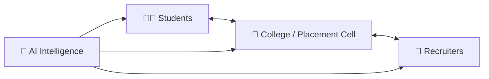

The platform can evolve from a traditional placement management system into an intelligent career and recruitment ecosystem.

---

# 📌 Project Highlights

| Area | Implementation |
|---|---|
| 🏗️ Architecture | Modular Monolith |
| ☕ Backend | Java + Spring Boot |
| 🔐 Security | Spring Security + JWT |
| 🗄️ Database | PostgreSQL |
| 🧠 Vector Search | pgvector |
| ⚡ Cache | Redis |
| 📨 Messaging | Apache Kafka |
| 🤖 AI | Spring AI |
| 🌐 Frontend | Next.js + React |
| 🐳 Containerization | Docker |
| ☁️ Cloud | AWS |
| 🧪 Testing | JUnit + Mockito + Integration Tests |
| 📡 API Style | REST |

---

# ⭐ Why This Project?

This project combines multiple real-world software engineering concepts into one complete system.

```text
Java
   +
Spring Boot
   +
Spring Security
   +
PostgreSQL
   +
Redis
   +
Kafka
   +
Spring AI
   +
pgvector
   +
Next.js
   +
Docker
   +
AWS
```

The development journey covers:

```text
Requirements
      ↓
Feasibility Analysis
      ↓
Stakeholder Analysis
      ↓
System Architecture
      ↓
Database Design
      ↓
REST API Design
      ↓
Authentication
      ↓
Core Backend
      ↓
Frontend
      ↓
Caching
      ↓
Event-Driven Processing
      ↓
AI Integration
      ↓
Testing
      ↓
Containerization
      ↓
Cloud Deployment
```

---

# 👨‍💻 Author

## Md. Kaif

🎓 **B.Tech Information Technology**  
🏫 **KIET Group of Institutions**  
📅 **2024–2028**

### Technical Interests

- ☕ Java
- 🌱 Spring Boot
- 🏗️ Backend Engineering
- 🌐 Full-Stack Development
- 🤖 AI / Generative AI
- ☁️ Cloud Computing
- 📨 Distributed Systems
- 🧩 System Design
- 📊 Data Engineering

---

# ⭐ Support

If you find this project useful or interesting:

⭐ **Star the repository**

🍴 **Fork the repository**

🐛 **Report issues**

💡 **Suggest improvements**

🤝 **Contribute**

---

<p align="center">

# 🚀 Building a Smarter Placement Ecosystem

### Java • Spring Boot • AI • Kafka • Redis • PostgreSQL • Next.js • Docker • AWS

<br>

**Made with ❤️ by Md. Kaif**

</p>
